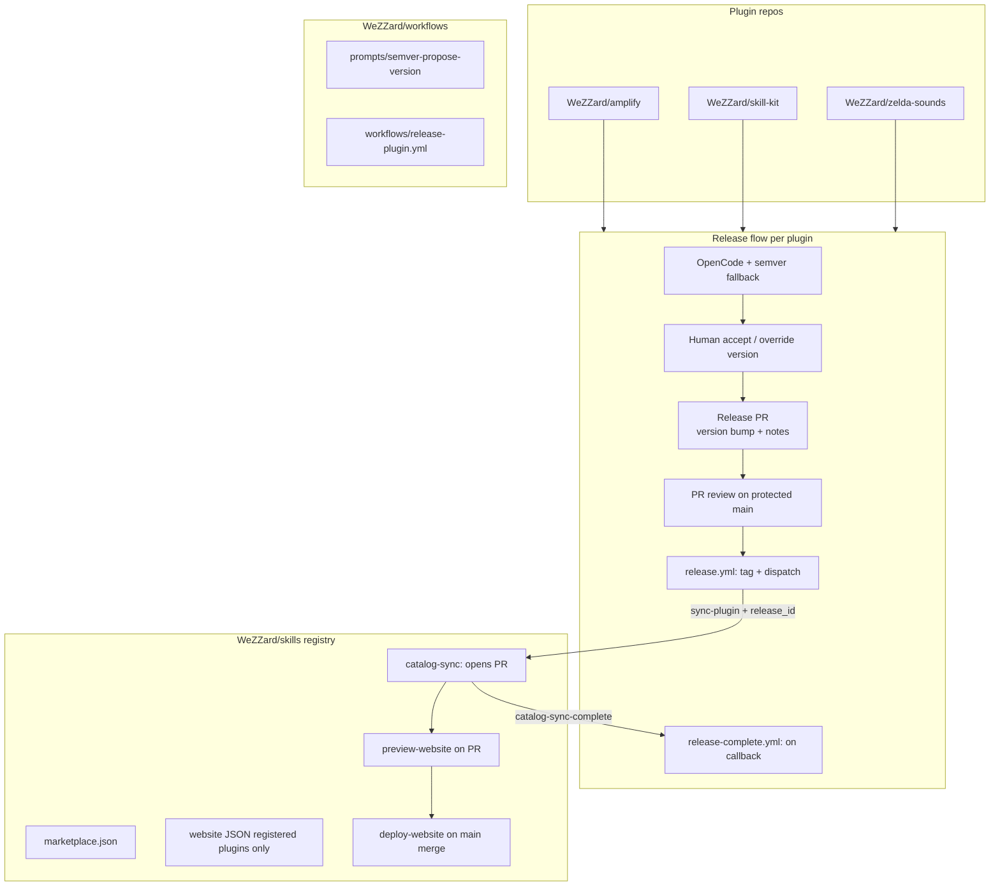

# Plugin split and catalog orchestration

> **Note:** This describes the full target state. For the current milestone see [v1-scope.md](./v1-scope.md).

Target-state plan. For agreed decisions see [alignments.md](./alignments.md). For build order see [execution.md](./execution.md).

## Target architecture



**Already done:** [`opencode-vision`](https://github.com/WeZZard/opencode-vision) is standalone (npm); not listed in skills catalog.

---

## Release policy

### Branch protection

- `main` protected on all repos; changes via PR only.
- Required status checks before merge.

### Version bumping

Remove pre-commit auto-bump from plugin repos (`.githooks/pre-commit` today). Version changes **only** in a dedicated release PR.

### Human-cleared release (`WeZZard/workflows`)

1. Analyze commits since last tag + `plugin.json` / zelda `manifest.json`.
2. OpenCode + `semver-propose-version.md`, or **`suggest-version.mjs`** fallback (conventional commits).
3. Human accept or override version.
4. Open release PR: bump version, optional `CHANGELOG`.
5. PR review on protected `main`.
6. On merge → `release.yml` tags and dispatches to skills.

### Plugin `release.yml` (via `WeZZard/workflows`)

```yaml
uses: WeZZard/workflows/.github/workflows/release-plugin.yml@v1.0.0
with:
  plugin_name: amplify
  version_file: .claude-plugin/plugin.json
secrets:
  SKILLS_DISPATCH_TOKEN: ${{ secrets.SKILLS_DISPATCH_TOKEN }}
```

**Trigger:** push to `main` when `plugin.json` / `manifest.json` version changed.

**Steps:** read version → idempotent tag `vV` → GitHub Release → `repository_dispatch` to skills:

```json
{
  "event_type": "sync-plugin",
  "client_payload": {
    "release_id": "550e8400-e29b-41d4-a716-446655440000",
    "plugin": "amplify",
    "version": "1.2.61",
    "tag": "v1.2.61",
    "sha": "<merge commit sha>",
    "repo": "WeZZard/amplify"
  }
}
```

**Job ends after dispatch is accepted** — no polling skills workflows.

### Cross-repo chaining (callback)

```mermaid
sequenceDiagram
  participant PluginRelease as plugin release.yml
  participant SkillsSync as skills catalog-sync
  participant SkillsPR as skills PR + preview
  participant PluginDone as plugin release-complete.yml

  PluginRelease->>PluginRelease: tag vX.Y.Z
  PluginRelease->>SkillsSync: repository_dispatch sync-plugin
  PluginRelease->>PluginRelease: job succeeds
  SkillsSync->>SkillsPR: open catalog PR + preview deploy
  SkillsSync->>PluginDone: repository_dispatch catalog-sync-complete
  PluginDone->>PluginDone: verify release_id; fail if status=failed
  Note over SkillsPR: human merges PR to main
```

Skills dispatches **`catalog-sync-complete`** to plugin repo:

```json
{
  "event_type": "catalog-sync-complete",
  "client_payload": {
    "release_id": "...",
    "plugin": "amplify",
    "tag": "v1.2.61",
    "status": "pr_opened | failed",
    "pr_url": "https://github.com/WeZZard/skills/pull/42",
    "preview_url": "https://..."
  }
}
```

Plugin **`release-complete.yml`** runs on that event; fails (email) if `status=failed` or `release_id` mismatch.

---

## Skills registry orchestrator

### Triggers

| Trigger | Workflow |
|---------|----------|
| `repository_dispatch` `sync-plugin` | `catalog-sync.yml` |
| `workflow_dispatch` `{ plugin, tag }` | `catalog-sync.yml` (recovery) |
| `workflow_dispatch` `{ plugin, tag }` | `rollback-catalog.yml` |
| `workflow_dispatch` | `register-plugin-website.yml` |
| `workflow_dispatch` | `regenerate-all` |

### One dispatch → one bot PR

Catalog-sync opens a PR (no direct push to `main`):

```
chore(catalog): sync amplify v1.2.61
release_id: 550e8400-...
```

| File | Change |
|------|--------|
| `.claude-plugin/marketplace.json` | `git-subdir` pin + marketplace patch bump |
| `catalog/lock.json` | Generated resolved pins |
| `website/.../generated/plugins/<name>.json` | Registered plugins only |
| `website/.../generated/skills/*.json` | Registered plugins only |
| `README.md` | Deterministic regen from template |

### SSOT files

| File | Role |
|------|------|
| `marketplace.json` | Hand-edited plugin list + pins (after sync, in PR) |
| `catalog/lock.json` | Generated resolved metadata |
| `catalog/website-registry.json` | Hand-edited: which plugins get website pages |

### Unified website prompt

Single prompt `website/prompts/update-plugin-website.md`:

- **Inputs:** fetched plugin tree, TOML, existing JSON, `SKILL.md` hashes
- **Outputs:** generated plugin + skill JSON; TOML patches when skill set changes
- **Invoked by:** `catalog-sync` (registered plugins) and `register-plugin-website`
- **Fast path:** TOML → JSON when hashes unchanged (skip LLM)
- **LLM path:** when TOML stale or skill added/changed

Refactor `website/scripts/generate-content.ts` into `update-plugin-website.mjs`.

---

## Repo layouts

### `WeZZard/workflows`

```
workflows/
  prompts/semver-propose-version.md
  scripts/release.mjs
  scripts/suggest-version.mjs
  scripts/rollback-catalog.sh
  .github/workflows/
    release-plugin.yml
    test-release-plugin.yml
```

### `WeZZard/skills`

```
skills/
  catalog/lock.json
  catalog/website-registry.json
  scripts/resolve-plugin.mjs
  scripts/sync-plugin.mjs
  scripts/update-plugin-website.mjs
  scripts/generate-readme.mjs
  prompts/readme-update.md
  website/prompts/update-plugin-website.md
  .github/workflows/
    catalog-sync.yml
    preview-website.yml
    rollback-catalog.yml
    register-plugin-website.yml
    deploy-website.yml
```

### Target `marketplace.json` entry

```json
{
  "name": "amplify",
  "source": {
    "source": "git-subdir",
    "url": "WeZZard/amplify",
    "path": ".",
    "ref": "v1.2.61",
    "sha": "abc123..."
  }
}
```

Trust `plugin.json` version in fetched release; do not duplicate version in marketplace entry per Claude Code docs.

---

## Migration phases (logical)

| Phase | Content |
|-------|---------|
| 0 | `WeZZard/workflows` — semver + release GHA |
| 1 | Orchestrator in skills (plugins may still be in-tree during skeleton) |
| 2 | Extract amplify + `git-subdir` pin |
| 3 | Extract skill-kit (gated: two amplify releases) |
| 4 | Extract zelda-sounds (Claude only) |
| 5 | Strip `claude/` from skills; finalize catalog |

Map these onto [execution.md](./execution.md) skeleton → chain → intelligence layers.

---

## Verification checklist

- [ ] Workflows tagged; consumers pin `@v1.0.0`
- [ ] Protected `main` everywhere
- [ ] Feature merge does not tag; release PR merge tags + dispatches
- [ ] Catalog-sync opens PR (not push); preview URL posted
- [ ] Callback `catalog-sync-complete` fires; `release-complete.yml` fails on `status=failed`
- [ ] `claude plugin validate` + shallow-clone layer pass before PR
- [ ] Merge catalog PR → production deploy
- [ ] Rollback via `gh workflow run` opens repin PR
- [ ] `/plugin install` smoke test with `git-subdir` pins
- [ ] Unregistered plugin release skips website JSON

---

## Risks and mitigations

| Risk | Mitigation |
|------|------------|
| Release flood from pre-commit bump | Version only in release PR |
| Catalog PR never merged | Pin in PR until merge; users on old pin until merge |
| Callback dispatch fails | Manual `workflow_dispatch` recovery |
| LLM flakiness on website sync | TOML fast-path; fail PR if LLM required and API down |
| `validate` misses remote pins | Layer 2 shallow-clone |
| Workflows pin stale | Dry-run + tagged releases |
| Zelda generator complexity | Phase 4 last; simplify build.mjs |
| Two plugins release concurrently | Per-plugin concurrency; lock.json merge conflicts visible in PR |
