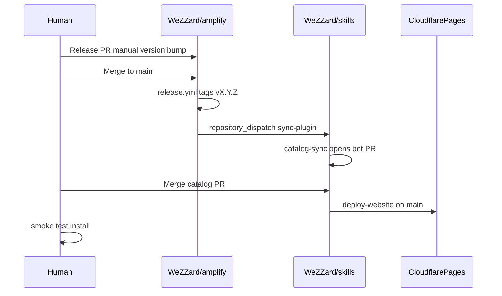

# v1 scope

First shippable milestone: **amplify end-to-end** via deterministic catalog sync. Full target architecture lives in [plan.md](./plan.md).

## Success criteria

Two manual amplify release cycles:

1. Release PR on `WeZZard/amplify` → tag → dispatch → catalog PR → merge → deploy
2. `/plugin install` smoke test passes with `git-subdir` pin
3. Website reflects generated JSON from pinned tag

See [release-runbook.md](./release-runbook.md) and [smoke-test.md](./smoke-test.md).

## In v1

| Item | Status |
|------|--------|
| `WeZZard/amplify` standalone repo + inline `release.yml` | Done |
| `git-subdir` marketplace pin for amplify | Done |
| Hybrid marketplace (skill-kit, zelda in-tree) | Done |
| `catalog-sync.yml` bot PR workflow | Done |
| Scripts: sync, website fast-path, readme, validate-pins | Done |
| Pre-commit excludes amplify | Done |
| `claude/amplify/` removed from skills | Done |
| `preview-website.yml` → `skills-website-staging` (one URL per PR) | Done |

## Deferred to v2+

- `WeZZard/workflows` repo + `@v1.0.0` reusable workflow pins
- `release-complete.yml` callbacks
- OpenCode / `suggest-version.mjs` in CI
- LLM website generation in CI
- `rollback-catalog.yml`, `register-plugin-website.yml`
- skill-kit and zelda-sounds extract
- Strip all `claude/` from skills

## v1 decisions

| Topic | Decision |
|-------|----------|
| Callback | **None** — plugin release succeeds when dispatch is accepted |
| Semver | Manual bump in release PR only |
| Workflows repo | Inline `release.yml` in amplify |
| Website sync | TOML fast-path only in catalog-sync |
| Marketplace | amplify = `git-subdir`; others = `./claude/*` |

## Flow

